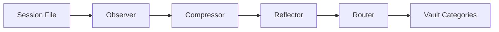

Observational memory automatically converts raw session transcripts into structured, prioritized observations. Instead of manually capturing every important moment, ClawVault watches your sessions and extracts what matters.

## The Pipeline

### Observer → Compressor → Reflector → Router



1. **Observer** - Monitors session files for new content
2. **Compressor** - LLM extracts key observations with priorities
3. **Reflector** - Applies temporal decay and deduplication
4. **Router** - Auto-categorizes into vault folders

## Priority System

Observations use emoji priorities that determine routing and retention:

### **Critical**
- **Decisions** with lasting impact
- **Errors** and blockers that need attention
- **Deadlines** and urgent commitments
- **Architecture** choices

**Retention:** Permanent (never pruned)

### **Notable**
- **Preferences** and working styles
- **People** interactions and relationship notes
- **Process** improvements and insights
- **Progress** on significant milestones

**Retention:** Long-term (months)

### **Info**
- **Routine** status updates
- **Deployments** and standard operations
- **Meeting** attendance and basic notes
- **General** progress updates

**Retention:** 7 days (auto-pruned for noise reduction)

## Auto-Routing to Categories

The router automatically places observations in appropriate vault categories:

```bash
 "Decided to use PostgreSQL over SQLite"
  → decisions/database-choice-2026-02-13.md

 "Sarah prefers Slack over email for quick questions"
  → people/sarah-chen/2026-02-13.md

 "Learned that async validation improves UX significantly"
  → lessons/2026-02-13.md

 "Deployed v2.1.0 to staging"
  → inbox/2026-02-13.md
```

## LLM Compression

The compressor uses LLM APIs (Gemini, Anthropic, or OpenAI) to:

- **Extract** key moments from conversational text
- **Classify** priority levels using business impact
- **Route** to appropriate memory types
- **Deduplicate** similar observations

### Fallback Rules

When LLM APIs are unavailable, rule-based classification kicks in:

```javascript
// Decision detection
/\b(decided|chose|going with|selected)\b/i

// Error patterns
/\b(error|failed|broke|bug|issue)\b/i

// People mentions
/\b(talked to|meeting with|@\w+)\b/i
```

## Usage

### Automatic (Sleep/Wake)

```bash
# Session transcript auto-processed on sleep
clawvault sleep "built user auth" --session-transcript ./session.md

# Observations included in wake context
clawvault wake
```

### Manual Processing

```bash
# One-shot compression
clawvault observe --compress session.md

# Watch mode for real-time processing
clawvault observe --watch ./sessions/

# Background daemon
clawvault observe --daemon
```

### Configuration

Control observation behavior with environment variables:

```bash
# Disable LLM compression (rules-only)
export CLAWVAULT_NO_LLM=1

# Use specific LLM
export GEMINI_API_KEY="your-key"
export ANTHROPIC_API_KEY="your-key"
export OPENAI_API_KEY="your-key"
```

## Entity-Aware Routing

Observations mentioning people or projects route to entity subfolders:

```bash
# Observation: "Pedro suggested using Railway for deployment"
# Routes to: people/pedro/2026-02-13.md

# Observation: "ClawVault docs need better examples"
# Routes to: projects/clawvault/2026-02-13.md
```

This creates rich entity histories visible in Obsidian's graph view.

## Integration with Context

Recent observations ( and ) automatically inject into:

- **Wake summaries** - What happened recently
- **Context queries** - Graph-neighbor observations
- **Executive summaries** - LLM-generated session briefs

:::tip
Use `clawvault context "query" --profile incident` to prioritize recent critical observations during troubleshooting.
:::

## Deduplication

The reflector prevents observation spam:

- **Normalize** content (strip timestamps, whitespace)
- **Compare** using Jaccard similarity
- **Merge** similar observations within time windows
- **Preserve** the most detailed version

## Example Session Flow

```bash
# Start session
clawvault wake
# → Shows recent  observations in context

# Work happens (conversations, decisions, debugging)
# → Observer watches session file

# End session
clawvault sleep "fixed auth bug" --session-transcript session.md
# → Compressor extracts:
# "Auth token validation fixed"
# "Redis session store performs better than file-based"
# "Updated dependencies to latest versions"

# Next session
clawvault wake
# → Recent critical/notable observations in recap
```

This system ensures important context survives across sessions without manual effort.