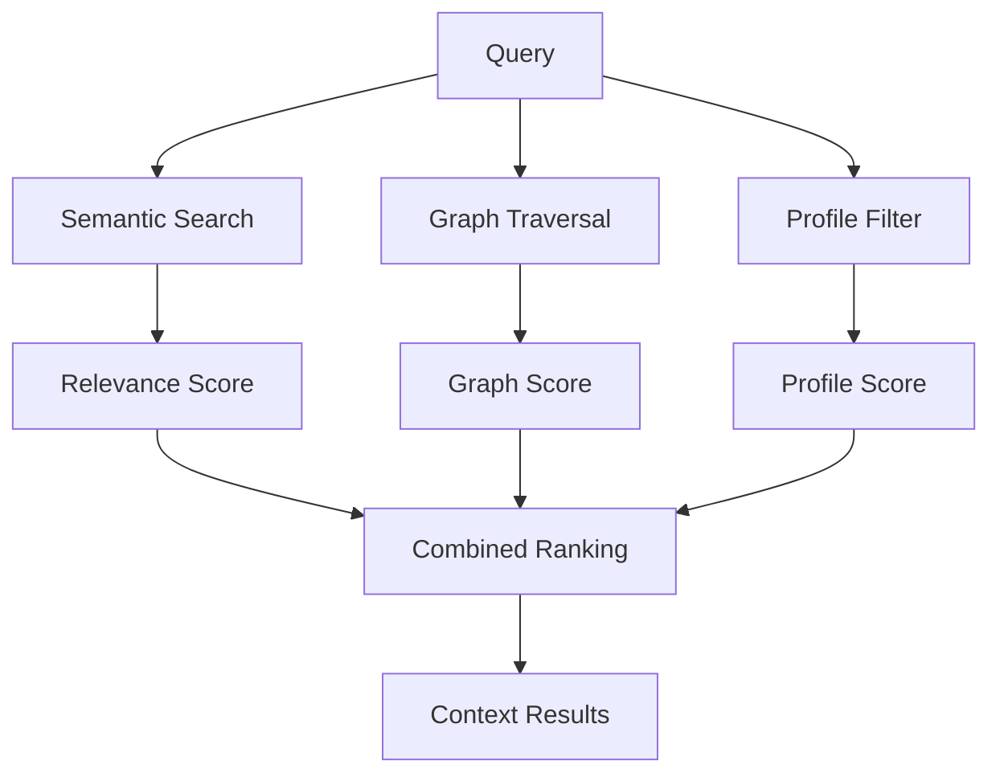

import { Callout } from "fumadocs-ui/components/callout";


The `context` command provides intelligent context injection by combining semantic search with graph-neighbor traversal. It's ClawVault's most sophisticated retrieval system, designed for LLM context windows.

## clawvault context

**Retrieve contextually relevant memories for LLM injection.**

```bash
clawvault context <query> [options]
```

### Basic Usage

```bash
# Get context for current work
clawvault context "database performance optimization"

# Planning session context
clawvault context "Q1 roadmap priorities"

# Incident response context 
clawvault context "API timeout production issue"
```

### Context Algorithm

The context system blends three signals:

1. **Semantic relevance** - How well content matches your query
2. **Graph connectivity** - Related memories through wiki-links and tags
3. **Profile optimization** - Task-specific weighting and filtering



## Options

| Flag | Description | Default |
|------|-------------|---------|
| `--profile <name>` | Context profile (default/planning/incident/handoff/auto) | default |
| `--format <fmt>` | Output format (markdown/json) | markdown |
| `--budget <tokens>` | Target token budget for results | 2000 |
| `--max-hops <n>` | Maximum graph expansion hops | 2 |
| `--graph-depth <n>` | Graph traversal depth (alias for --max-hops) | 2 |
| `-v, --verbose` | Include explain metadata | false |

## Context Profiles

Profiles optimize retrieval for specific scenarios:

### default
Balanced retrieval for general use:

```bash
clawvault context "authentication implementation"
# → Returns: related decisions, code examples, people involved, lessons learned
```

### planning 
Strategic context for roadmapping:

```bash
clawvault context "user dashboard roadmap" --profile planning
# → Emphasizes: decisions, commitments, project status, strategic lessons
# → Includes: longer historical context, architectural choices
```

### incident
Crisis-focused for troubleshooting:

```bash
clawvault context "database connection failures" --profile incident
# → Prioritizes: recent errors, similar incidents, contact information
# → Emphasizes: last 48 hours, actionable information
```

### handoff
Session transition context:

```bash
clawvault context "current work status" --profile handoff
# → Focuses: recent handoffs, active commitments, blockers, next steps
```

### auto
Automatic profile detection:

```bash
clawvault context "urgent production issue" --profile auto
# → Detects: incident (keywords: urgent, production, issue)

clawvault context "Q1 planning session" --profile auto
# → Detects: planning (keywords: Q1, planning, session)
```

## Output Formats

### Markdown (Default)

```bash
clawvault context "database decisions" --format markdown
```

```markdown
# Context: database decisions

## Primary Results

### Use PostgreSQL over SQLite
**Category:** decisions | **Modified:** 2026-02-13

Need concurrent writes for multi-agent setup. SQLite locks cause bottlenecks under load. [[pedro]] recommended PostgreSQL for better concurrency.

**Graph connections:** → [[user-auth-project]], [[performance-testing]]

### Database Connection Pooling Strategy 
**Category:** lessons | **Modified:** 2026-02-12

PgBouncer reduced connection overhead by 60%. Critical for scaling beyond 100 concurrent users.

**Graph connections:** → [[postgresql-setup]], [[infrastructure-decisions]]

## Graph Neighbors

### Pedro Martinez - Database Architect
**Category:** people | **Connected via:** 3 shared decisions

PostgreSQL expert, available for architecture reviews. Prefers technical RFCs over informal discussions.

## Context Metadata

- **Query:** database decisions
- **Profile:** default 
- **Results:** 8 memories, ~1,850 tokens
- **Graph depth:** 2 hops
- **Semantic matches:** 5, Graph neighbors: 3
```

### JSON (Detailed)

```bash
clawvault context "database decisions" --format json
```

```json
{
 "query": "database decisions",
 "profile": "default",
 "metadata": {
 "totalResults": 8,
 "estimatedTokens": 1850,
 "executionTime": "147ms",
 "semanticMatches": 5,
 "graphNeighbors": 3
 },
 "entries": [
 {
 "id": "decisions/postgresql-choice",
 "title": "Use PostgreSQL over SQLite", 
 "category": "decisions",
 "path": "decisions/postgresql-choice.md",
 "lastModified": "2026-02-13T09:15:00Z",
 "excerpt": "Need concurrent writes for multi-agent setup...",
 "explain": {
 "semanticScore": 0.92,
 "graphScore": 0.78, 
 "temporalScore": 0.95,
 "signals": [
 "direct_semantic_match",
 "connected_to_active_project",
 "recent_modification"
 ],
 "rationale": "High semantic relevance + active project connections + recent decision"
 },
 "graphConnections": [
 { "target": "people/pedro", "type": "wiki-link", "strength": 0.8 },
 { "target": "projects/user-auth", "type": "wiki-link", "strength": 0.9 }
 ]
 }
 ]
}
```

## Graph-Aware Retrieval

Context traverses your knowledge graph to find related memories:

```bash
# Query: "authentication strategy"
# Direct matches: authentication decisions, auth lessons
# Graph neighbors: people who worked on auth, related projects, implementation details

clawvault context "authentication strategy" -v
```

**Graph traversal includes:**
- **Wiki-linked entities** - `[[people]]`, `[[projects]]`, `[[decisions]]`
- **Tag relationships** - `#security`, `#authentication` 
- **Frontmatter connections** - `related: ["oauth-decision"]`
- **Entity routing** - people/pedro/ connects to Pedro's involvement

## Token Budget Management

Control context size for LLM efficiency:

```bash
# Small context window
clawvault context "query" --budget 1000

# Large context for complex tasks
clawvault context "query" --budget 4000

# Let ClawVault optimize
clawvault context "query" --budget auto
```

**Budget allocation:**
- 60% - Primary semantic matches
- 25% - Graph neighbors 
- 15% - Metadata and structure

## Verbose Mode

Get detailed scoring explanations:

```bash
clawvault context "database migration" -v --format json
```

**Explain fields:**
- `semanticScore` - Query relevance (0-1)
- `graphScore` - Connection strength (0-1) 
- `temporalScore` - Recency factor (0-1)
- `signals` - Why this result surfaced
- `rationale` - Human-readable explanation

## Integration Patterns

### OpenClaw Hook Integration

```javascript
// session:start event automatically uses context
const query = extractQueryFromSession(sessionStart);
const context = await vault.context(query, { profile: 'auto' });
injectIntoSession(context);
```

### LLM Context Injection

```bash
# Get context for LLM prompt
CONTEXT=$(clawvault context "implement OAuth" --format markdown --budget 2000)

# Use in prompt
echo "Given this context: $CONTEXT\n\nHow should I implement OAuth for our application?"
```

### Workflow Automation

```bash
# Morning context briefing
clawvault context "today's priorities" --profile handoff > daily-briefing.md

# Pre-meeting context
clawvault context "client demo preparation" --profile planning > meeting-prep.md

# Incident response context
clawvault context "production API errors" --profile incident > incident-context.md
```

## Advanced Usage

### Multi-Query Context

```bash
# Combine multiple contexts
clawvault context "authentication implementation" > auth-context.md
clawvault context "database performance" >> auth-context.md 
clawvault context "team responsibilities" >> auth-context.md
```

### Profile Comparison

```bash
# See how profiles differ
clawvault context "database issues" --profile default > default.md
clawvault context "database issues" --profile incident > incident.md
diff default.md incident.md
```

### Graph Expansion (--max-hops)

_Updated in v2.2.0: `--max-hops` replaces `--graph-depth` (which remains as an alias)._

```bash
# Shallow traversal (faster, focused)
clawvault context "query" --max-hops 1

# Default traversal (balanced)
clawvault context "query" --max-hops 2

# Deep traversal (slower, comprehensive) 
clawvault context "query" --max-hops 3
```

## Performance Optimization

### Response Times

| Graph Depth | Avg Response | Use Case |
|-------------|--------------|----------|
| 1 hop | ~100ms | Quick lookups |
| 2 hops | ~200ms | Balanced retrieval |
| 3 hops | ~500ms | Comprehensive context |

### Caching

Context results are cached briefly:

```bash
# First call: builds context (~200ms)
clawvault context "database"

# Subsequent calls: cached (~20ms) 
clawvault context "database decisions" # Similar query, cached components
```

## Error Handling

```bash
# Empty vault
clawvault context "query"
# Returns: minimal context, suggests running `clawvault init`

# qmd not available
clawvault context "query" 
# Fallback: file-based search, limited semantic understanding

# Invalid profile
clawvault context "query" --profile invalid
# Error: Unknown profile. Valid: default, planning, incident, handoff, auto
```

## Best Practices

### Query Formulation

```bash
# Good: Specific, actionable queries
clawvault context "implement user authentication with OAuth"
clawvault context "debug production database connection issues" 
clawvault context "plan Q1 feature roadmap"

# Less effective: Vague queries
clawvault context "work stuff"
clawvault context "things"
```

### Profile Selection

- **default** - Regular development work
- **planning** - Meetings, roadmaps, architecture decisions 
- **incident** - Production issues, debugging, urgent fixes
- **handoff** - Session starts, status updates, continuity
- **auto** - Let ClawVault decide based on query keywords

### Context Size Optimization

```bash
# For complex tasks: larger budget
clawvault context "implement new feature" --budget 3000

# For simple queries: smaller budget
clawvault context "find contact info" --budget 500

# For exploration: verbose mode
clawvault context "authentication patterns" -v --format json
```

<Callout type="info">
The context command is designed for LLM integration. Use it to provide relevant background for AI agents working on specific tasks.
</Callout>

Context retrieval transforms your vault from a static knowledge base into an intelligent assistant that understands relationships and provides task-appropriate information.
