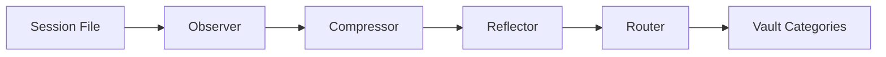

import { Callout } from "fumadocs-ui/components/callout";


Observational memory automatically converts raw session transcripts into structured, prioritized observations. Instead of manually capturing every important moment, ClawVault watches your sessions and extracts what matters — code releases, client meetings, pricing decisions, strategy pivots, and everything in between.

## The Pipeline

### Observer → Compressor → Reflector → Router



1. **Observer** - Monitors session files for new content (including active sessions)
2. **Compressor** - LLM extracts key observations with priorities
3. **Reflector** - Applies temporal decay and deduplication
4. **Router** - Auto-categorizes into vault folders

## Active Session Observation

_Added in v2.1.0_

Long-running sessions accumulate valuable context that traditional stale-session sweeps miss entirely. Active session observation solves this with incremental, threshold-based triggers.

### How It Works

1. On each heartbeat, ClawVault runs a cheap `stat` check on all session files
2. Per-session byte cursors track how much has already been observed
3. When new content crosses a size threshold, only the delta gets compressed
4. Cursors are updated so the same content is never processed twice

### Smart Thresholds

Thresholds scale with session size to avoid over-processing small sessions or under-processing large ones:

| Session Size | Trigger Threshold |
|---|---|
| Under 1 MB | 50 KB new content |
| 1-5 MB | 150 KB new content |
| Over 5 MB | 300 KB new content |

### Triggers

Active observation fires automatically on:

- **Heartbeat** - Periodic threshold checks (cheapest path)
- **Context compaction** - Forces flush before context is lost
- **`/new` command** - Captures everything before session reset

### Manual Usage

```bash
# Preview what would be observed
clawvault observe --active --dry-run

# Run active observation
clawvault observe --active

# Override threshold (observe everything with 1+ new bytes)
clawvault observe --active --min-new 1

# Target a specific agent
clawvault observe --active --agent myagent
```

Cursors are stored in `.clawvault/observe-cursors.json`.

## Scored Importance System

_Updated in v2.2.0_

Observations use scored importance tags that determine routing and retention. Each observation is tagged with a type, confidence score, and importance score:

```
[type|c=confidence|i=importance]
```

### Observation Types

| Type | Description |
|------|-------------|
| `decision` | Choices with lasting impact (technical or business) |
| `preference` | Working styles, tool choices, communication preferences |
| `fact` | Objective information, specifications, configurations |
| `commitment` | Promises made, deadlines set, obligations accepted |
| `milestone` | Version releases, demos completed, contracts signed |
| `lesson` | Insights learned from experience or mistakes |
| `relationship` | People interactions, roles, contact preferences |
| `project` | Project status updates, architecture changes |

### Importance Thresholds

Importance scores determine retention and routing behavior:

| Threshold | Score | Retention | Examples |
|-----------|-------|-----------|----------|
| **Structural** | >= 0.8 | Permanent (never pruned) | Decisions, version releases, client demos, pricing decisions, strategy pivots, commitments |
| **Potential** | 0.4 - 0.79 | Long-term (months) | Production deploys, new tools built, proposals sent, preferences, people interactions |
| **Contextual** | < 0.4 | 7 days (auto-pruned) | Routine status updates, intermediate build steps, minor fixes |

### Example Observations

```markdown
[decision|c=0.95|i=0.9] Chose PostgreSQL over SQLite for concurrent writes
[milestone|c=0.99|i=0.85] Published clawvault@2.2.0 to npm
[relationship|c=0.8|i=0.6] Sarah prefers Slack over email for quick questions
[lesson|c=0.85|i=0.7] Async validation improves UX significantly
[fact|c=0.9|i=0.3] Build takes approximately 45 seconds
```

### Backward Compatibility

ClawVault v2.2.0 remains backward compatible with the legacy emoji priority format. Existing observations are read correctly, and the `migrate-observations` command converts them to scored format:

```bash
clawvault migrate-observations
```

## Ledger Architecture

_Added in v2.2.0_

Observations follow a ledger-first architecture. Raw transcripts are preserved separately from compiled observations:

```
vault/
└── ledger/
    ├── raw/<source>/          # Raw session transcripts
    ├── observations/YYYY/MM/DD.md  # Compiled daily observations
    ├── reflections/YYYY-WNN.md     # Weekly reflection summaries
    └── archive/                    # Archived old observations
```

- **Raw transcripts** are stored in `ledger/raw/<source>/` where `<source>` is the channel (e.g., `main`, `telegram-dm`, `discord`)
- **Compiled observations** land in `ledger/observations/YYYY/MM/DD.md` (date-partitioned by year and month directories)
- **Reflections** are weekly summaries in `ledger/reflections/YYYY-WNN.md`
- **Archive** contains old observations excluded from search and graph traversal

## Auto-Routing to Categories

The router automatically places observations in appropriate vault categories:

```bash
[decision|c=0.95|i=0.9] "Decided to use PostgreSQL over SQLite"
 → decisions/2026-02-13.md

[relationship|c=0.8|i=0.6] "Sarah prefers Slack over email for quick questions"
 → people/sarah/2026-02-13.md

[milestone|c=0.99|i=0.85] "Artemisa demo completed"
 → projects/2026-02-13.md

[milestone|c=0.99|i=0.9] "Published clawvault@2.2.0 to npm"
 → projects/2026-02-13.md

[lesson|c=0.85|i=0.7] "Learned that async validation improves UX significantly"
 → lessons/2026-02-13.md
```

## LLM Compression

The compressor uses LLM APIs (Gemini, Anthropic, or OpenAI) to:

- **Extract** key moments from conversational text
- **Classify** observation types and assign confidence/importance scores
- **Attribute** actions to specific people or agents
- **Deduplicate** similar observations

### Post-Processing Safety Net

Even when the LLM assigns incorrect scores, regex-based enforcement rules correct them:

- Version releases (`published X@2.2.0`) are always scored as structural importance (>= 0.8)
- Signed contracts and pricing decisions are always structural
- Deployments and infrastructure changes are always at least potential importance (>= 0.4)

### Fallback Rules

When LLM APIs are unavailable, rule-based classification kicks in using pattern matching for decisions, errors, people mentions, deadlines, and project milestones.

## Usage

### Automatic (Recommended)

With the OpenClaw hook installed, observation happens automatically:

- **Heartbeat** checks session thresholds periodically
- **`/new`** flushes before session reset
- **Context compaction** flushes before memory is lost
- **Sleep** processes session transcripts on session end

```bash
# Everything below happens automatically with the hook
clawvault sleep "built user auth" --session-transcript ./session.md
clawvault wake  # Recent observations included in context
```

### Manual Processing

```bash
# One-shot compression of a file
clawvault observe --compress session.md

# Active session observation (incremental)
clawvault observe --active

# Watch mode for real-time processing
clawvault observe --watch ./sessions/
```

### Configuration

Control observation behavior with environment variables:

```bash
# Disable LLM compression (rules-only)
export CLAWVAULT_NO_LLM=1

# LLM provider (first available key is used)
export GEMINI_API_KEY="your-key"      # Gemini 2.0 Flash (recommended)
export ANTHROPIC_API_KEY="your-key"
export OPENAI_API_KEY="your-key"
```

## Entity-Aware Routing

Observations mentioning people or projects route to entity subfolders:

```bash
# "Pedro suggested using Railway for deployment"
# → people/pedro/2026-02-13.md

# "Published ClawVault v2.1.0 with active observer"
# → projects/2026-02-13.md
```

This creates rich entity histories visible in Obsidian's graph view.

## Source Labels

When observing OpenClaw sessions, each observation is tagged with its source:

| Label | Meaning |
|---|---|
| `[main]` | Primary agent session |
| `[telegram-dm]` | Telegram direct message |
| `[telegram-group]` | Telegram group chat |
| `[discord]` | Discord channel |
| `[cron]` | Scheduled task |
| `[subagent]` | Sub-agent session |

This provides attribution when reviewing observations across multiple channels.

## Integration with Context

Recent observations automatically inject into:

- **Wake summaries** - What happened recently
- **Context queries** - Graph-neighbor observations
- **Executive summaries** - LLM-generated session briefs

<Callout type="info">
Use `clawvault context "query" --profile incident` to prioritize recent critical observations during troubleshooting.
</Callout>

## Deduplication

The reflector prevents observation spam:

- **Normalize** content (strip timestamps, whitespace)
- **Compare** using bigram Jaccard similarity (threshold: 0.8)
- **Merge** similar observations within time windows
- **Preserve** the most detailed version
